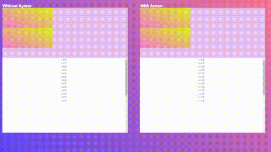

# Ayncat

The objective of Ayncat is to allow the development of animations controlled by JavaScript,
not that they are executed with an action but that their entire execution is controlled by JavaScript.

### Instalation

#### NPM

> npm i ayncat --save

#### yanr

> yarn add ayncat --save

#### File

> You can use ayncat.all.js file located in dist folder

## Example



## Animation in real time

You can see how the example using Ayncat (right) moves along with the scroll in real time,
while the example not using Ayncat (left) runs completely on reaching the intersectionObserver.

## Animation in gradients

Also Ayncat allows you to animate even the linear-gradient,
while css does not allow you to animate the colors of a gradient.

## Works with percents

works with anything that gives it a percentage and that percentage will be the time of the animation.
This is what allows Ayncat to work in real time

## Usage

Using Ayncat is very easy but first
There are only two things to keep in mind!
Look at the [Recommendations](#recomendations) before using Ayncat

### To use ayncat

Import Ayncat and declare two variables in JSON format,
one with the initial styles and one with the final styles

You can think of this as a "from" "to" in CSS

_Example_

```JavaScript
import Ayncat from 'ayncat';

const prevStyles = {
    margin: "5px 3px",
    background: "#5544ff",
    transform: "rotate(25deg)",
}

const newStyles = {
    margin: "0px 0px",
    background: "#ff4455",
    tranform: "rotate(-25deg)",
}
```

Now call ayncat and pass it a css selector that you want to apply ayncat to,
and the two variables you created.

```JavaScript
    const cssSelector = ".myElements";
    const myElementsAyncat = new Ayncat(cssSelector, prevStyles, newStyles);
```

Lastly, run inside a function that sends some percentage to Ayncat.

```JavaScript
    const handleMove = percent =>{
        myElementsAyncat.run = percent;
    }
```

For example, let's look at what this would look like
applied to a scrollable element like in the [first example](#example)

```JavaScript
    const threshold = [];
    for(let i = 0.00; i < 1.00; i = i +0.01){
        threshold.push(i)
    }
    const options = {
        root: document.querySelector('#scrollArea'),
        rootMargin: "0px",
        threshold,
    }
    const handleScroll = ([entry])=> {
        const percent = entry * 100;
        myElementAyncat.run percent;
    }

    const observer = new IntersectionObserver(handleScroll, options);
    observer.observe(document.querySelector("#element")); //Element inside the scroll area
```

For more information about intersectionObserver visit the [MDN Reference](https://developer.mozilla.org/en-US/docs/Web/API/Intersection_Observer_API)

## Recomendations

| Using Ayncat is very easy, you just need to know CSS and some JavaScript
| Just keep in mind to follow these recommendations.

### 1. Do not declare values ​​of different types in the same property

_Example_
Do not do this ❌

```JavaScript
        //INCORRET
        const prevStyles = {
            padding: "7pt",    //Done, the same unit of measure is used in both styles
            margin: "5px 0px", //Incorrect, different units of measure were used
        }

        const newStyles = {
            padding: "12pt",      //Done, the same unit of measure is used in both styles
            margin: "4rem 3rem", //Incorrect, different units of measure were used
        }

```

If you use px in one also do it in the other, Ayncat supports all types of css values,
but it does not support the mixture of these in the same property.

Do it like this ✅

```JavaScript
        //Corret ✅

        const prevStyles = {
            padding: "7pt",    //Done, the same unit of measure is used in both styles
            margin: "5px 0px", //Done, the same unit of measure is used in both styles
        }

        const newStyles = {
            padding: "12pt",   //Done, the same unit of measure is used in both styles
            margin: "4px 3px", //Done, the same unit of measure is used in both styles
        }
```

### 2. To avoid errors, remember to declare the same number of values in each property

Do not do this ❌

```JavaScript
    //INCORRET ❌
    const prevStyle = {
        margin: "7px 5px 4px",
    }

    const newStyle = {
        margin: "0px", //Error two values are missing
    }
```

Do it like this ✅

```JavaScript
    //INCORRET ❌
    const prevStyle = {
        margin: "7px 5px 4px",
    }

    const newStyle = {
        margin: "0px 0px 0px", // Done the same number of values
    }
```

[How to use Ayncat](#usage)

[Code documentation](https://garruxx.github.io/Ayncat/)
